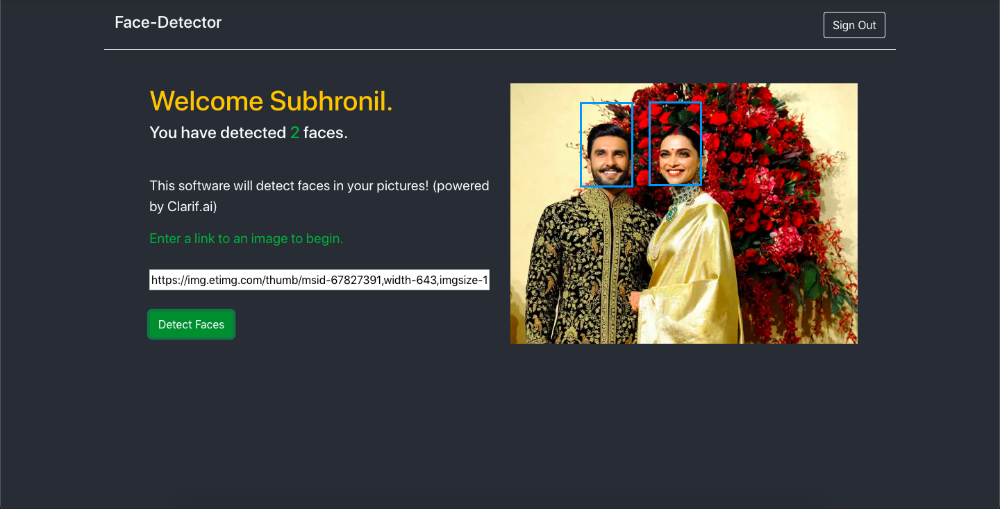

# Face Detection Implementation using ReactJS and Clarifai API

This is an implementation of a face detection software in React hooked to the Clarifai Face Detection Model API. 

## How does it work?

1. You sign in with your name.
2. You provide a link to an image.
3. The API scans through your image for faces.
4. It displays the number of faces in your image while also highlighting them.

## Screenshots

